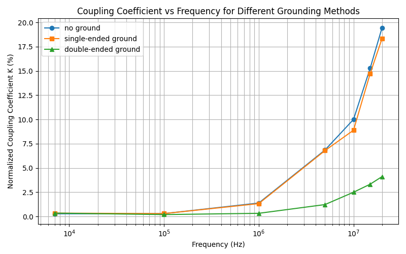

# Rapport d'expérimentation CEM

## Introduction

Ce rapport étudie, par une série d'expériences menées dans la bande 7 kHz – 20 MHz, l'influence des pistes blindées, des plans de masse et des modes de mise à la terre des cages de blindage sur le diaphonie entre pistes et les perturbations des transmissions numériques sur circuit imprimé. Les expériences se fondent sur les théories de couplage capacitif et inductif (I = 2πFCmU, U = 2πFMI) et consistent à mesurer la variation de la tension/courant de couplage en fonction de la fréquence pour valider l'efficacité de différentes protections (blindage, mise à la terre simple/double, continuité du plan de masse) et fournir des recommandations pratiques pour la conception de PCB.

# A. Diaphonie entre pistes

## A.1 Effet du blindage de piste et de sa connexion à la masse

### A.1.1 Objectif de l'expérience

Étudier l'effet des modes de mise à la terre d'une piste blindée sur la diaphonie entre pistes à différentes fréquences, et vérifier les caractéristiques théoriques du couplage capacitif et inductif en fonction de la fréquence.

### A.1.2 Configuration expérimentale

Matériel utilisé :

- Circuit imprimé CEM1/I/1
- Générateur sinusoïdal 0–20 MHz
- Oscilloscope (impédance d'entrée réglée à 50 Ω)
- Câbles BNC

Configuration de test :

- Le signal d'entrée est appliqué à la piste « sa » (piste source)
- Le signal de sortie est mesuré sur la piste perturbée
- Trois états de mise à la terre : non connecté, mis à la terre d'un seul côté, mis à la terre des deux côtés

### A.1.3 Données expérimentales

#### A.1.3.1 Tableau des mesures brutes

| Fréquence | Uin (V) | Uout non connecté (mV) | Uout une extrémité à la masse (mV) | Uout deux extrémités à la masse (mV) |
| --- | ---: | ---: | ---: | ---: |
| 7 kHz | 1.79 | 5.0 | 6.3 | 6.3 |
| 100 kHz | 1.78 | 5.4 | 5.4 | 3.5 |
| 1 MHz | 1.80 | 25.0 | ~24.0 | 6.0 |
| 5 MHz | 1.81 | 124.0 | ~123.0 | 22.2 |
| 10 MHz | 1.80 | 180.0 | ~160.0 | 45.0 |
| 15 MHz | 1.80 | 275.0 | ~265.0 | 60.0 |
| 20 MHz | 1.80 | 350.0 | ~330.0 | 74.0 |

*Remarque : certaines valeurs en mise à la terre d'une extrémité sont estimées (approx.) en raison d'une variation de 1–2 mV par rapport à la mise à la terre des deux extrémités.*

#### A.1.3.2 Tableau des coefficients de couplage normalisés

Le coefficient de couplage normalisé est défini par : K = Uout / Uin × 100 %

| Fréquence | K non connecté (%) | K une extrémité (%) | K deux extrémités (%) |
| --- | ---: | ---: | ---: |
| 7 kHz | 0.28 | 0.35 | 0.35 |
| 100 kHz | 0.30 | 0.30 | 0.20 |
| 1 MHz | 1.39 | 1.33 | 0.33 |
| 5 MHz | 6.85 | 6.79 | 1.23 |
| 10 MHz | 10.00 | 8.89 | 2.50 |
| 15 MHz | 15.28 | 14.72 | 3.33 |
| 20 MHz | 19.44 | 18.33 | 4.11 |

Figure 1 : Effet du mode de mise à la terre sur le coefficient de couplage normalisé en fonction de la fréquence

### A.1.4 Analyse par bande de fréquence

#### A.1.4.1 Bande basse fréquence (7 kHz – 100 kHz)

Dans la bande basse fréquence, la tension d'interférence reste très faible (5.0–6.3 mV) et le coefficient K est inférieur à 0.35 %. Les trois états de mise à la terre donnent des résultats presque identiques : à 7 kHz, la mise à la terre d'une ou des deux extrémités donne 6.3 mV, indiquant que le blindage de piste a peu d'effet à basse fréquence. À 100 kHz, la mise à la terre des deux extrémités présente une légère amélioration (3.5 mV contre 5.4 mV), et la tension d'interférence tend à diminuer légèrement avec la fréquence.

#### A.1.4.2 Bande moyenne fréquence (1 MHz – 5 MHz)

En bande moyenne, le niveau d'interférence augmente fortement, passant de 25 mV à 1 MHz à 124 mV à 5 MHz. La mise à la terre des deux extrémités commence à montrer une efficacité évidente : à 1 MHz elle réduit l'interférence de 76 % (25 mV → 6 mV), et à 5 MHz de 82 % (124 mV → 22.2 mV). La mise à la terre d'une seule extrémité reste peu efficace et diffère peu de l'état non connecté (amélioration d'environ 1–2 mV).

#### A.1.4.3 Bande haute fréquence (10 MHz – 20 MHz)

En haute fréquence, la diaphonie est la plus marquée : sans blindage la perturbation augmente fortement, de 180 mV (10 MHz) à 350 mV (20 MHz), le coefficient atteignant 19.44 % à 20 MHz, proche d'un cinquième de l'amplitude d'entrée. La mise à la terre des deux extrémités offre une forte atténuation (75–79 %). À 15 MHz, elle réduit l'interférence de 275 mV à 60 mV ; la mise à la terre d'une seule extrémité est légèrement meilleure que l'absence de mise à la terre mais reste loin de la performance en double mise à la terre. On observe également un déphasage entre le signal d'interférence et le signal d'origine à haute fréquence.

### A.1.5 Interprétation théorique

Les phénomènes observés s'expliquent par les mécanismes de couplage électromagnétique. D'après la formule du couplage capacitif I = 2πFCmU et la formule du couplage inductif U = 2πFMI, l'intensité du couplage est proportionnelle à la fréquence. À basse fréquence, le terme en fréquence est faible, de sorte que les courants et tensions induits par couplage capacitif et inductif restent négligeables, rendant l'effet du blindage peu apparent.

Quand la fréquence monte au niveau des MHz, les effets de couplage augmentent rapidement et la piste blindée devient efficace : pour le couplage capacitif, la piste blindée intercepte les lignes de champ comme un "parapluie" ; pour le couplage inductif, la piste blindée doit former une boucle de retour vers la masse pour intercepter efficacement le champ magnétique. La mise à la terre d'une seule extrémité ne fournit qu'un blindage partiel (écran électrique) et ne crée pas une boucle de blindage complète pour le champ magnétique, d'où une efficacité limitée.

En haute fréquence, plusieurs effets interviennent simultanément : l'effet de peau concentre le courant HF en surface, les courants de retour suivent le chemin le plus proche, renforçant mutuellement l'inductance et la capacitance ; les conducteurs se comportent comme des lignes de transmission et l'impédance caractéristique devient dominante ; l'énergie de couplage capacitif et inductif tend à s'équilibrer. Le déphasage observé provient de la superposition d'un couplage inductif (U en retard par rapport à I) et d'un couplage capacitif (I en avance sur U) avec des caractéristiques de phase différentes. La mise à la terre des deux extrémités forme une boucle de blindage complète, interceptant champs électrique et magnétique et fournissant un chemin de retour basse impédance, d'où son efficacité en haute fréquence. La mise à la terre d'une seule extrémité, avec une impédance non négligeable à haute fréquence entre le point de masse et l'autre extrémité, ne peut pas efficacement intercepter le flux magnétique et perd son effet de blindage.

# B. Effet du plan de masse sur la diaphonie

## B.1 Objectif

Étudier l'effet de la présence et de la continuité d'un plan de masse sur la diaphonie entre pistes, en mettant l'accent sur l'impact d'une fissure dans le plan de masse.

## B.2 Configuration expérimentale

- Circuit testé : CEM1/I/2 (avec plan de masse présentant une fissure)
- Source de signal : générateur sinusoïdal, amplitude d'entrée ≈ 1.7 V (pp)
- Plage de fréquence : 7 kHz – 20 MHz
- Configurations du plan de masse :
  - Sans plaque de cuivre additionnelle (configuration de référence, fissure présente)
  - Grande plaque de cuivre (surface de masse doublée)
  - Petite plaque de cuivre pontant la fissure au milieu (liaison en forme d'haltère)
  - Petite plaque pontant au bord

## B.3 Données expérimentales

### B.3.1 Résultats mesurés

| Fréquence | Sans plaque | Grande plaque | Petite plaque (pont central) | Petite plaque (pont bord) |
| --- | ---: | ---: | ---: | ---: |
| 7 kHz | 12 mV | 12 mV | - | - |
| 100 kHz | 12 mV | 12 mV | - | - |
| 1 MHz | 11 mV | 7 mV | 6 mV | ~10 mV |
| 2.5 MHz | 21 mV | 10 mV | 8 mV | - |
| 4 MHz | 30 mV | 14 mV | 10 mV | - |
| 5 MHz | 38 mV | 18 mV | 13 mV | 31 mV |
| 10 MHz | 70 mV | 30 mV | 22 mV | 64 mV |
| 15 MHz | 120 mV | 50 mV | 40 mV | - |
| 20 MHz | 125 mV | 60 mV | 40 mV | 125 mV |

*Remarque : toutes les valeurs d'interférence sont des tensions crête-à-crête.*

Figure 2 : Effet de la configuration du plan de masse sur la diaphonie en fonction de la fréquence

### B.3.2 Comparaison de l'atténuation

À 20 MHz, les atténuations obtenues selon les configurations sont : la grande plaque de cuivre réduit l'interférence de 52 % (125 mV → 60 mV), la petite plaque pontant au milieu atteint 68 % d'atténuation (125 mV → 40 mV), tandis que la petite plaque pontant au bord n'a pratiquement aucun effet (reste à 125 mV).

## B.4 Analyse des phénomènes

Les résultats montrent qu'à basse fréquence la fissure dans le plan de masse a peu d'impact et que les différentes configurations de plaques donnent des différences minimes. En haute fréquence, l'interférence augmente fortement avec la fréquence et les différentes configurations de plaques montrent des efficacités bien distinctes. Le pontage central par une petite plaque est le plus efficace pour réduire l'interférence haute fréquence ; la grande plaque est la suivante ; le pontage au bord est inefficace.

## B.5 Interprétation théorique

À haute fréquence, les courants de retour choisissent le chemin le plus court ; une fissure augmente la surface de la boucle de retour, augmentant l'inductance mutuelle et renforçant la diaphonie. Le pontage central par une petite plaque réduit efficacement le chemin de retour, diminuant fortement la diaphonie ; le pontage au bord est inefficace. À basse fréquence l'effet est négligeable. Conclusion principale : optimiser la continuité du plan de masse et le chemin de retour est plus important qu'augmenter simplement la surface.

# C. Effet de la cage de blindage et de sa connexion à la masse sur les perturbations de transmission

## C.1 Objectif

Étudier l'effet d'une cage métallique de blindage et de son mode de mise à la terre sur la protection des lignes de transmission numériques, et valider la nécessité d'une mise à la terre adéquate du blindage.

## C.2 Configuration expérimentale

- Composant perturbé : circuit d'affichage numérique (composants A+B) connecté par des liaisons multiples
- Composant perturbateur : circuit de commutation à relais générant des transitoires électromagnétiques
- Dispositif de blindage : tube métallique (cage de blindage)
- Modes de mise à la terre :
  - Cage non mise à la terre
  - Cage mise à la terre d'une extrémité (liaison par tresse)
  - Cage mise à la terre aux deux extrémités (liaisons par tresse)
- Distances de test : proche, moyenne, éloignée

## C.3 Résultats expérimentaux

| Mode de mise à la terre | Proche | Moyenne | Éloignée |
| --- | ---: | ---: | ---: |
| Sans cage | Perturbation | Perturbation | Aucun |
| Mise à la terre une extrémité | Perturbation | Perturbation | Aucun |
| Mise à la terre deux extrémités | **Aucune perturbation** | **Aucune perturbation** | **Aucune perturbation** |

*Remarque : « Perturbation » signifie que l'afficheur numérique présente des erreurs de comptage ou des anomalies.*

## C.4 Analyse des phénomènes

Les résultats indiquent que sans cage ou avec mise à la terre d'une seule extrémité, on observe des perturbations à distance proche et moyenne ; seules les distances éloignées sont exemptes d'interférence. Avec une mise à la terre aux deux extrémités, toutes les distances testées ne montrent aucune perturbation et l'afficheur numérique fonctionne normalement.

## C.5 Interprétation théorique

Le circuit de commutation par relais produit des transitoires électromagnétiques (oscillation à 160 kHz, tension crête ≈ 1200 V) qui peuvent s'accoupler magnétiquement aux lignes de transmission. Lors d'une mise à la terre d'une seule extrémité, la cage présente une impédance à haute fréquence (la longueur de la tresse ajoute une réactance) et ne peut pas détourner efficacement les courants d'interférence. La mise à la terre aux deux extrémités crée une boucle de blindage basse impédance et permet aux courants de se déverser dans la masse, évitant ainsi le couplage vers les fils de signal. Cela rejoint la conclusion sur l'effet de peau : à haute fréquence la longueur des conducteurs influe directement sur l'impédance, et un contact de masse de longueur nulle (360°) est optimal. Conclusion clé : il est nécessaire d'assurer un blindage avec mise à la terre double et basse impédance pour protéger efficacement contre les interférences électromagnétiques haute fréquence.

## Conclusion

Les résultats expérimentaux montrent clairement que : à basse fréquence (kHz) la diaphonie est faible et les différences de modes de blindage et de mise à la terre sont peu marquées ; mais en bande MHz la diaphonie augmente fortement et la mise à la terre double des pistes blindées ainsi que la continuité et la minimisation des chemins de retour dans le plan de masse peuvent réduire considérablement le couplage (taux d'atténuation supérieur à 70 %). Une cage de blindage sans mise à la terre double et basse impédance est peu efficace. Il faut garantir la continuité du plan de masse, raccourcir le chemin de retour et utiliser une mise à la terre double basse impédance pour améliorer la compatibilité électromagnétique des PCB.
