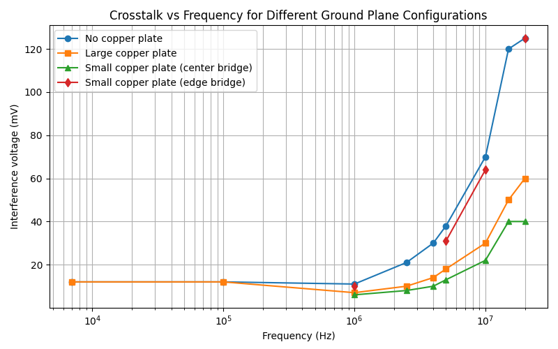

# CEM 实验报告

## 引言

本报告通过在 7 kHz 至 20 MHz 频段内进行的一系列实验，系统研究了屏蔽轨迹、接地平面与屏蔽笼的接地方式对印刷电路板上轨迹串扰和数字传输干扰的影响。实验结合容性与感性耦合理论（I = 2πFCmU，U = 2πFMI），通过测量耦合电压/电流随频率的变化来验证不同防护措施（屏蔽、单端/双端接地、接地平面连续性）的有效性，并为 PCB 设计提供实践性建议。

# A. 轨迹间串扰

## A.1 屏蔽轨迹及其与地线连接的影响

### A.1.1 实验目的

研究屏蔽轨迹的接地方式对不同频率下轨迹间串扰的影响，验证容性串扰和感性串扰随频率变化的理论特性。

### A.1.2 实验设置

**使用材料：**

- CEM1/I/1印刷电路板
- 0-20 MHz正弦波发生器
- 示波器（输入阻抗调整至50Ω)
- BNC连接电缆

**测试配置：**

- 输入信号施加于"sa"轨迹（攻击者轨迹）
- 输出信号测量于受干扰轨迹
- 三种接地状态：不接地、单端接地、双端接地

### A.1.3 实验数据

#### A.1.3.1 原始测量数据表

| 频率 | 输入电压 Uin (V) | 不接地 Uout (mV) | 单端接地 Uout (mV) | 双端接地 Uout (mV) |
| --- | --- | --- | --- | --- |
| 7 kHz | 1.79 | 5.0 | 6.3 | 6.3 |
| 100 kHz | 1.78 | 5.4 | 5.4 | 3.5 |
| 1 MHz | 1.80 | 25.0 | ~24.0 | 6.0 |
| 5 MHz | 1.81 | 124.0 | ~123.0 | 22.2 |
| 10 MHz | 1.80 | 180.0 | ~160.0 | 45.0 |
| 15 MHz | 1.80 | 275.0 | ~265.0 | 60.0 |
| 20 MHz | 1.80 | 350.0 | ~330.0 | 74.0 |

*注：单端接地在某些频率点的数据为估算值，基于双端接地相比有1-2 mV的变化。*

#### A.1.3.2 归一化耦合系数数据表

归一化耦合系数定义为：**K = Uout / Uin × 100%**

| 频率 | 不接地 K (%) | 单端接地 K (%) | 双端接地 K (%) |
| --- | --- | --- | --- |
| 7 kHz | 0.28 | 0.35 | 0.35 |
| 100 kHz | 0.30 | 0.30 | 0.20 |
| 1 MHz | 1.39 | 1.33 | 0.33 |
| 5 MHz | 6.85 | 6.79 | 1.23 |
| 10 MHz | 10.00 | 8.89 | 2.50 |
| 15 MHz | 15.28 | 14.72 | 3.33 |
| 20 MHz | 19.44 | 18.33 | 4.11 |

Figure 1 : 接地方式对归一化耦合系数随频率变化的影响

### A.1.4 频段特性分析

#### A.1.4.1 低频段（7 kHz - 100 kHz）特性

在低频段，干扰电压维持在5.0~6.3 mV的极低水平，耦合系数K均低于0.35%。三种接地状态下的测量结果几乎完全一致，7 kHz时单端和双端接地均为6.3 mV，说明低频下屏蔽轨迹作用不明显。100 kHz时双端接地略有改善（3.5 mV vs 5.4 mV），此外干扰电压随频率略有下降的趋势。

#### A.1.4.2 中频段（1 MHz - 5 MHz）特性

进入中频段后，干扰水平显著上升，从1 MHz的25 mV激增至5 MHz的124 mV。此时双端接地开始显示出明显效果：在1 MHz时可将干扰降低76%（25 mV → 6 mV），在5 MHz时降低82%（124 mV → 22.2 mV）。值得注意的是，单端接地效果仍然有限，与不接地状态相差不大（仅1-2 mV改善）。

#### A.1.4.3 高频段（10 MHz - 20 MHz）特性

高频段呈现出最显著的串扰现象。不接地时干扰急剧上升，从180 mV (10 MHz)飙升至350 mV (20 MHz)，耦合系数在20 MHz时达到19.44%，接近输入信号的1/5。双端接地在此频段表现出色，抑制率维持在75-79%之间。15 MHz时双端接地干扰显著降低（由原275 mV降至60 mV），单端接地略优于不接地（265 mV vs 275 mV），但仍远不如双端接地。此外，在高频段明显观察到干扰信号与原信号之间存在相位偏移现象。

### A.1.5 理论解释

上述实验现象可以从电磁耦合机制得到解释。根据容性串扰公式 **I = 2πFCmU** 和感性串扰公式 **U = 2πFMI**，耦合强度与频率成正比。在低频下，频率项较小，容性和感性耦合产生的干扰电流和电压都很微弱，因此屏蔽轨迹的作用不明显。

随着频率上升至MHz级别，耦合效应迅速增强。此时屏蔽轨迹开始发挥作用：对于容性串扰，屏蔽轨迹如同电场中的"雨伞"拦截场线；对于感性串扰，屏蔽轨迹必须与地线形成闭合回路才能有效拦截磁场。单端接地只能提供部分电场屏蔽，无法形成完整的磁屏蔽回路，因此效果有限。

在高频段，多种效应共同作用：趋肤效应使高频电流集中在导体表面，返回电流沿最近路径流动，增强了互感和互容效应；导体呈现传输线特性，特性阻抗成为主导因素；容性和感性耦合的能量趋于等效。相位偏移现象正是由于感性耦合（U滞后于I）和容性耦合（I超前于U）机制同时存在且相位特性不同所致。双端接地形成完整的屏蔽回路，同时拦截电场和磁场，并提供低阻抗返回路径，因此在高频下效果显著。而单端接地由于接地点到另一端的阻抗在高频下不可忽略，无法有效拦截磁通量变化，基本失去屏蔽作用。

# B. 接地平面对串扰的影响

## B.1 实验目的

研究接地平面的存在及其连续性对轨迹间串扰的影响，特别是接地平面中裂缝的影响。

## B.2 实验配置

- **测试电路**: CEM1/I/2印刷电路（带接地平面，存在裂缝）
- **信号源**: 正弦波发生器，输入信号幅值恒定约1.7V（峰峰值）
- **测试频率范围**: 7kHz - 20MHz
- **接地平面配置**:
  - 无额外铜板（基准配置，裂缝存在）
  - 大铜板（接地面积增加1倍）
  - 小铜板桥接中间位置（哑铃型连接）
  - 小铜板桥接边缘位置

## B.3 实验数据

### B.3.1 测量结果汇总表

| 频率 | 无铜板 | 大铜板 | 小铜板(中间) | 小铜板(边缘) |
|------|--------|--------|-------------|-------------|
| 7kHz | 12mV | 12mV | - | - |
| 100kHz | 12mV | 12mV | - | - |
| 1MHz | 11mV | 7mV | 6mV | ~10mV |
| 2.5MHz | 21mV | 10mV | 8mV | - |
| 4MHz | 30mV | 14mV | 10mV | - |
| 5MHz | 38mV | 18mV | 13mV | 31mV |
| 10MHz | 70mV | 30mV | 22mV | 64mV |
| 15MHz | 120mV | 50mV | 40mV | - |
| 20MHz | 125mV | 60mV | 40mV | 125mV |

*注: 所有干扰值为峰峰值电压*

Figure 2 : 接地平面配置对串扰随频率变化的影响

### B.3.2 干扰衰减效果对比

在20MHz测试频率下，不同接地配置的衰减效果为：大铜板配置实现了52%的干扰衰减（从125mV降至60mV），小铜板中间桥接配置达到了68%的衰减（从125mV降至40mV），而小铜板边缘桥接几乎没有衰减效果（保持在125mV）。

## B.4 实验现象分析

实验结果表明：低频时接地平面裂缝影响很小，各种铜板配置效果差异不明显。高频时干扰随频率显著增加，且不同铜板配置对干扰抑制作用明显。中间桥接铜板效果最佳，能大幅降低高频干扰；大铜板次之；边缘桥接几乎无效。

## B.5 理论解释

高频时，返回电流会选择最短路径，裂缝导致回路面积变大，互感增强，串扰加重。中间桥接铜板能有效缩短回流路径，显著降低串扰；边缘桥接无效。低频时影响较小。核心结论：优化接地平面连续性和回流路径比单纯增加面积更重要。

# C. 屏蔽笼与接地连接对传输干扰的影响

## C.1 实验目的

研究金属屏蔽笼及其接地连接方式对数字传输线路电磁干扰的防护效果,验证屏蔽接地的必要性。

## C.2 实验配置

- **受干扰组件**: 数字显示器电路(组件A+B),通过多线连接传输
- **攻击者组件**: 继电器开关电路,产生瞬态电磁干扰
- **屏蔽装置**: 金属喉管(屏蔽笼)
- **接地配置**:
  - 屏蔽笼不接地
  - 屏蔽笼单端接地(通过辫子连接)
  - 屏蔽笼双端接地(通过辫子连接)
- **测试距离**: 近距离、中距离、远距离(三个不同间隔)

## C.3 实验结果汇总

| 接地配置 | 近距离 | 中距离 | 远距离 |
|---------|--------|--------|--------|
| 无屏蔽笼 | 干扰 | 干扰 | 无干扰 |
| 单端接地 | 干扰 | 干扰 | 无干扰 |
| 双端接地 | **无干扰** | **无干扰** | **无干扰** |

*注: "干扰"指数字显示器出现计数错误或异常*

## C.4 实验现象分析

实验结果表明:无屏蔽笼或单端接地配置下,近距离和中距离均出现明显干扰,仅在远距离时干扰消失。采用双端接地配置后,所有测试距离均实现完全屏蔽,数字显示器工作正常,未观察到任何计数异常。

## C.5 理论解释

继电器开关产生的瞬态电磁干扰(160kHz振荡,峰值电压约1200V)通过磁场耦合感应到传输线路。单端接地时,屏蔽笼存在高频阻抗路径(辫子长度引入感抗),无法有效分流干扰电流。双端接地形成完整的低阻抗屏蔽回路,干扰电流通过屏蔽层流回地线,避免耦合到信号线。这与第二部分趋肤效应实验结论一致:高频下导体长度直接影响阻抗,**零长度接地(360°接触)** 是最优方案。核心结论:**屏蔽必须配合双端低阻抗接地才能有效防护高频电磁干扰**。

## 结论

实验结果清晰表明：在低频段（kHz 级）串扰较小，屏蔽与接地方式差异不显著；但进入 MHz 级别后，串扰显著增加，双端接地的屏蔽轨迹和连续、短回流路径的接地平面能大幅降低耦合（高频下抑制率可达 70% 以上）。屏蔽笼在未实现低阻抗双端接地时效果有限。保证接地平面连续性、缩短回流路径并采用双端低阻抗接地以提高 PCB 的电磁兼容性。